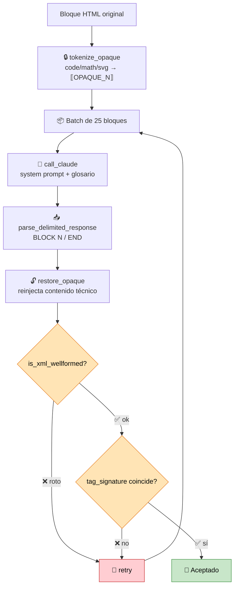
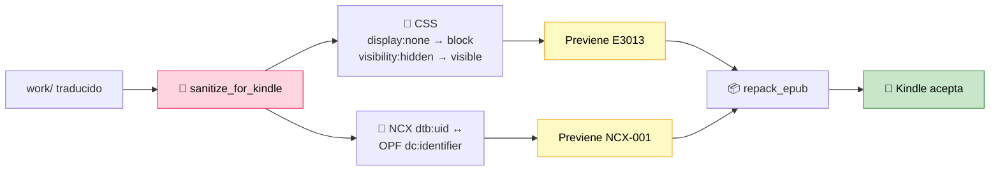

<div align="center">

# 📚 epub-translator

**Traductor automático de libros EPUB (EN → ES LATAM) con Claude AI**

Traduce libros EPUB completos del inglés al español latinoamericano neutro, preservando estructura HTML, bloques de código, imágenes y contenido técnico.

[](https://python.org)
[](https://docs.anthropic.com/en/docs/claude-code)
[](https://www.crummy.com/software/BeautifulSoup/)
[](https://lxml.de/)
[](LICENSE)

[](https://www.amazon.com/sendtokindle)
[](https://www.w3.org/TR/epub-33/)
[-success?style=flat-square)](https://www.anthropic.com/pricing)
[](#reanudar-una-traducción-interrumpida)
[](https://github.com/stivenrosales/epub-translator/commits/main)
[](https://github.com/stivenrosales/epub-translator/stargazers)
[](https://github.com/stivenrosales/epub-translator/pulls)

<br/>

*Traduce libros técnicos y de no-ficción completos — con glosarios por perfil, protección de código, validación estructural automática y saneamiento Kindle.*

---

</div>

## 🧠 ¿Qué es epub-translator?

Una herramienta CLI que traduce libros EPUB completos usando **Claude Sonnet** a través del Agent SDK. No es un traductor genérico — es un sistema inteligente que **detecta el tipo de libro**, aplica el perfil correcto, y protege todo el contenido técnico que no debe traducirse.

### ✨ Características principales

- 🔍 **Sistema multi-perfil** — auto-detecta el tipo de libro y aplica la estrategia correcta
- 🛡️ **Code-aware** — `<pre>`, `<code>`, `<math>`, `<svg>` nunca se tocan
- 🔒 **Tokenización opaca** — los tags `<code>` inline se reemplazan con tokens `⟦OPAQUE_N⟧` antes de traducir, y se restauran después
- 📖 **Glosario obligatorio por perfil** — terminología consistente en todo el libro
- ✅ **Validación XML estricta** — cada bloque traducido pasa por `lxml` antes de aceptarse (atrapa atributos rotos que disparan E999 en Kindle)
- 💾 **Reanudable** — checkpoint en `progress.json`, si se interrumpe se retoma donde quedó
- 📦 **EPUB válido** — mimetype primero (sin compresión), `dc:language` correcto, traducción de NCX
- 📱 **Kindle-ready automático** — saneamiento previo al empaquetado: neutraliza `display:none` (E3013), sincroniza NCX uid ↔ OPF identifier (NCX-001)

---

## 📋 Perfiles disponibles

| Perfil | Editorial | Tipo de libro | Ejemplo |
|--------|-----------|---------------|---------|
| `generic` | Penguin, HarperCollins, etc. | No-ficción, negocios, creatividad | *The Practice* — Seth Godin |
| `ai_engineering` | O'Reilly | Técnico con código, math y terminología ML | *AI Engineering* — Chip Huyen |
| `grokking_algorithms` | Manning | CS ilustrado con código Python | *Grokking Algorithms* — Aditya Bhargava |
| `superagency` | Simon & Schuster | Ensayo sobre AI y sociedad | *Superagency* — Reid Hoffman |
| `practical_sql` | No Starch Press | Técnico con SQL y análisis de datos | *Practical SQL* — Anthony DeBarros |

Cada perfil incluye su propio **glosario de términos**, **system prompt** adaptado al tono del autor, y **patrones de archivos a saltar**.

---

## 🚀 Instalación

### Requisitos previos

- **Python 3.10+**
- **[Claude Code](https://docs.anthropic.com/en/docs/claude-code)** con suscripción Max activa
  > El script usa el Agent SDK, que se autentica con tu sesión de Claude Code. No necesita API key y tiene costo incremental $0.

### Setup

```bash
git clone https://github.com/stivenrosales/epub-translator.git
cd epub-translator

python3 -m venv .venv
source .venv/bin/activate
pip install -r requirements.txt
```

---

## 💻 Uso

### Traducción básica

```bash
# Activar el entorno virtual
source .venv/bin/activate

# Colocar el .epub en la carpeta del proyecto y ejecutar
python3 translate_epub.py
```

Si hay múltiples EPUBs, aparece un menú de selección. El archivo traducido se guarda como `<nombre_original>_es.epub`.

### Reanudar una traducción interrumpida

```bash
# Simplemente volver a ejecutar — lee progress.json y salta archivos ya traducidos
python3 translate_epub.py
```

### Empezar de cero con un libro nuevo

```bash
# Limpiar estado anterior e iniciar
rm -rf work progress.json
python3 translate_epub.py
```

### Forzar un perfil específico

Editar `translate_epub.py` y cambiar:

```python
FORCE_PROFILE = "grokking_algorithms"  # o "generic", "ai_engineering", "superagency", "practical_sql"
```

---

## ⚙️ ¿Cómo funciona?

### Pipeline general


### Loop de traducción por bloque



### Saneamiento Kindle (post-procesamiento)



### Tabla de pasos

| Paso | Descripción |
|------|-------------|
| **1. Extraer** | Descomprime el EPUB en `work/` |
| **2. Detectar perfil** | Escanea patrones de markup (Manning vs O'Reilly vs genérico) |
| **3. Extraer bloques** | Encuentra `<p>`, `<h1>`–`<h6>`, `<li>`, etc. excluyendo subárboles `<pre>`, `<math>`, `<svg>` |
| **4. Tokenizar** | Reemplaza `<code>`, `<math>`, `<svg>` inline con placeholders `⟦OPAQUE_N⟧` |
| **5. Traducir** | Envía batches de 25 bloques a Claude Sonnet con contexto rolling y glosario |
| **6. Validar XML** | `lxml.etree` parsea cada bloque — si rompe un tag, retry |
| **7. Validar estructura** | Compara firma de tags (nombres, atributos, conteo) entre original y traducción |
| **8. Restaurar** | Reinserta contenido opaco original en las posiciones de tokens |
| **9. Sanear Kindle** | Neutraliza `display:none`/`visibility:hidden` en CSS, sincroniza NCX uid |
| **10. Empaquetar** | Construye EPUB válido (mimetype sin comprimir primero, según spec) |

---

## 📱 Compatibilidad con Kindle

Send-to-Kindle es notoriamente opaco — devuelve **E999 Internal Error** sin decir qué falla. Después de depurar varios libros, el script ahora previene automáticamente las tres causas reales:

| Error Kindle | Causa real | Fix automático |
|--------------|-----------|----------------|
| **E999** | Atributo HTML roto por la traducción (ej. `itemid` partido en varios atributos) | `is_xml_wellformed()` valida cada bloque con `lxml` y fuerza retry |
| **E3013** | >10k caracteres ocultos con `display:none` (TOCs/landmarks gigantes) | `sanitize_for_kindle()` convierte todo `display:none` → `display:block` |
| **NCX-001** | `dtb:uid` del NCX ≠ `dc:identifier` del OPF | `sanitize_for_kindle()` copia el valor del OPF al NCX |

> 💡 **Tip de diagnóstico**: si aparece algún E999 en un libro futuro, usá [Kindle Previewer 3](https://kdp.amazon.com/en_US/help/topic/G202131170) — es la única herramienta que expone el error real detrás del genérico de Amazon.

---

## 🆕 Agregar un nuevo perfil

Para soportar un nuevo tipo de libro, agregá 3 cosas en `translate_epub.py`:

1. **`GLOSSARY_*`** — diccionario con traducciones obligatorias de términos
2. **`SYSTEM_PROMPT_*`** — prompt del sistema con reglas de traducción y guía de tono
3. **`SKIP_PATTERNS_*`** — lista de regex de nombres de archivo a saltar

Registrá el perfil en el diccionario `PROFILES` y actualizá `detect_book_profile()` si querés auto-detección.

---

## ⚠️ Limitaciones

| Limitación | Detalle |
|------------|---------|
| 🖼️ Imágenes con texto | Los diagramas y figuras rasterizadas quedan en inglés — esto es un traductor DOM, no OCR |
| 🎯 Calidad semántica | La validación estructural detecta HTML roto, pero no errores de significado |
| ⏱️ Rate limits | El batch size y concurrencia están limitados por el Agent SDK |
| 👁️ Contenido oculto visible | El saneamiento Kindle hace visibles bloques que estaban `display:none` (landmarks, listas de figuras, etc.) — aparecen como secciones extras en el TOC |

---

## 📄 Licencia

Este proyecto está bajo la licencia **MIT** — ver [LICENSE](LICENSE) para más detalles.

---

<div align="center">

**Hecho con 🧉 y Claude AI**

</div>
