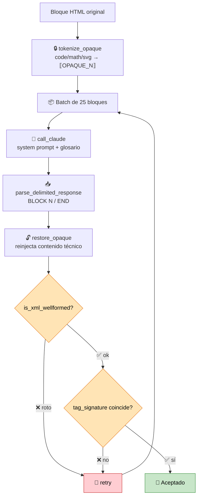
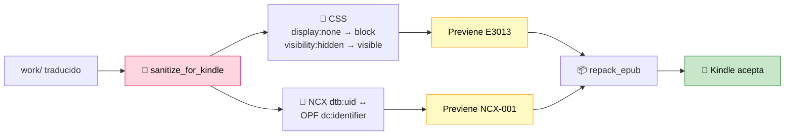

<div align="center">

# 📚 epub-translator

**Traductor automático de libros EPUB (EN → ES LATAM) con Claude AI**

Traduce libros EPUB completos del inglés al español latinoamericano neutro, preservando estructura HTML, bloques de código, imágenes y contenido técnico.

[](https://python.org)
[](https://docs.anthropic.com/en/docs/claude-code)
[](https://www.crummy.com/software/BeautifulSoup/)
[](https://lxml.de/)
[](LICENSE)

[](https://www.amazon.com/sendtokindle)
[](https://www.w3.org/TR/epub-33/)
[-success?style=flat-square)](https://www.anthropic.com/pricing)
[](#reanudar-una-traducción-interrumpida)
[](https://github.com/stivenrosales/epub-translator/commits/main)
[](https://github.com/stivenrosales/epub-translator/stargazers)
[](https://github.com/stivenrosales/epub-translator/pulls)

<br/>

*Traduce libros técnicos y de no-ficción completos — con glosarios por perfil, protección de código, validación estructural automática y saneamiento Kindle.*

---

</div>

## 🧠 ¿Qué es epub-translator?

Una herramienta CLI que traduce libros EPUB completos usando **Claude Sonnet** a través del Agent SDK. No es un traductor genérico — es un sistema inteligente que **detecta el tipo de libro**, aplica el perfil correcto, y protege todo el contenido técnico que no debe traducirse.

### ✨ Características principales

- 🔍 **Sistema multi-perfil** — auto-detecta el tipo de libro y aplica la estrategia correcta
- 🛡️ **Code-aware** — `<pre>`, `<code>`, `<math>`, `<svg>` nunca se tocan
- 🔒 **Tokenización opaca** — los tags `<code>` inline se reemplazan con tokens `⟦OPAQUE_N⟧` antes de traducir, y se restauran después
- 📖 **Glosario obligatorio por perfil** — terminología consistente en todo el libro
- ✅ **Validación XML estricta** — cada bloque traducido pasa por `lxml` antes de aceptarse (atrapa atributos rotos que disparan E999 en Kindle)
- 💾 **Reanudable** — checkpoint en `progress.json`, si se interrumpe se retoma donde quedó
- 📦 **EPUB válido** — mimetype primero (sin compresión), `dc:language` correcto, traducción de NCX
- 📱 **Kindle-ready automático** — saneamiento previo al empaquetado: neutraliza `display:none` (E3013), sincroniza NCX uid ↔ OPF identifier (NCX-001)
- 📖 **Enriquecimiento opcional** — `enrich_epub.py` incrusta guías de lectura + mapas conceptuales por capítulo, ideal para filosofía y ensayo denso

---

## 📋 Perfiles disponibles

### Técnicos / divulgación tecnológica

| Perfil | Editorial | Tipo de libro | Ejemplo |
|--------|-----------|---------------|---------|
| `generic` | Penguin, HarperCollins, etc. | No-ficción, negocios, creatividad | *The Practice* — Seth Godin |
| `ai_engineering` | O'Reilly | Técnico con código, math y terminología ML | *AI Engineering* — Chip Huyen |
| `grokking_algorithms` | Manning | CS ilustrado con código Python | *Grokking Algorithms* — Aditya Bhargava |
| `practical_sql` | No Starch Press | Técnico con SQL y análisis de datos | *Practical SQL* — Anthony DeBarros |

### Ensayo, biografía y filosofía

| Perfil | Editorial | Tipo de libro | Ejemplo |
|--------|-----------|---------------|---------|
| `superagency` | Authors Equity | Ensayo sobre IA y sociedad | *Superagency* — Reid Hoffman |
| `bismarck` | Oxford University Press | Biografía histórica académica | *Bismarck: A Life* — Jonathan Steinberg |
| `slow_looking` | Routledge | Educación + arte + ciencia (Project Zero) | *Slow Looking* — Shari Tishman |
| `the_score` | Penguin / Dutton | Filosofía social, juegos y métricas | *The Score* — C. Thi Nguyen |
| `lake_como` | Eerdmans (Ressourcement) | Filosofía-teología sobre técnica y naturaleza | *Letters from Lake Como* — Romano Guardini |
| `power_of_language` | Penguin / Dutton | Psicolingüística y bilingüismo | *The Power of Language* — Viorica Marian |
| `dewey_art_experience` | Penguin / Berkley | Estética filosófica pragmatista — terminología anclada en la traducción canónica de **Jordi Claramonte** | *Art as Experience* — John Dewey |

### Psicología, bienestar y comunidad

| Perfil | Editorial | Tipo de libro | Ejemplo |
|--------|-----------|---------------|---------|
| `how_to_be_enough` | St. Martin's Essentials | Psicología clínica de divulgación (perfeccionismo) | *How to Be Enough* — Ellen Hendriksen |
| `art_of_community` | Berrett-Koehler | Liderazgo, comunidad y pertenencia | *The Art of Community* — Charles H. Vogl |
| `life_in_three_dimensions` | Knopf / Doubleday | Psicología positiva y bienestar | *Life in Three Dimensions* — Shigehiro Oishi |

Cada perfil incluye su propio **glosario de términos** (a veces de varios cientos), **system prompt** adaptado al tono del autor, y **patrones de archivos a saltar** (por ej. índices alfabéticos masivos que no aportan valor traducidos).

---

## 🚀 Instalación

### Requisitos previos

- **Python 3.10+**
- **[Claude Code](https://docs.anthropic.com/en/docs/claude-code)** con suscripción Max activa
  > El script usa el Agent SDK, que se autentica con tu sesión de Claude Code. No necesita API key y tiene costo incremental $0.

### Setup

```bash
git clone https://github.com/stivenrosales/epub-translator.git
cd epub-translator

python3 -m venv .venv
source .venv/bin/activate
pip install -r requirements.txt
```

---

## 💻 Uso

### Traducción básica

```bash
# Activar el entorno virtual
source .venv/bin/activate

# Colocar el .epub en la carpeta del proyecto y ejecutar
python3 translate_epub.py
```

Si hay múltiples EPUBs, aparece un menú de selección. El archivo traducido se guarda como `<nombre_original>_es.epub`.

### Reanudar una traducción interrumpida

```bash
# Simplemente volver a ejecutar — lee progress.json y salta archivos ya traducidos
python3 translate_epub.py
```

### Empezar de cero con un libro nuevo

```bash
# Limpiar estado anterior e iniciar
rm -rf work progress.json
python3 translate_epub.py
```

### Forzar un perfil específico

Editar `translate_epub.py` y cambiar:

```python
FORCE_PROFILE = "the_score"  # cualquiera de los 14 perfiles disponibles
```

### Dashboard en vivo (read-only)

En otra terminal, mientras corre la traducción:

```bash
python3 dashboard.py
```

Muestra un panel TUI con `rich`: barra de progreso global con ETA real (calculado por throughput observado, no el inflado de `tqdm`), conteos `done`/`partial`/`pending`/`skipped` por archivo, eventos recientes con timestamps (warns, errores, fases de cierre), y estado del log y `progress.json`. **Read-only**: ábrelo y ciérralo cuando quieras, no afecta la traducción. `Ctrl+C` cierra solo el dashboard. Auto-detecta el `translate*.log` más reciente.

### Mantener la Mac despierta automáticamente

En macOS, `translate_epub.py` lanza `caffeinate -i -s -w PID` al inicio para evitar que la máquina se duerma durante traducciones largas. El proceso se cierra solo cuando termina el script. Si estás en Linux/Windows, no se hace nada (silencioso).

---

## 📖 Enriquecimiento: guías de lectura + mapas conceptuales

Para libros densos (filosofía, ensayo), un segundo script **opcional** —`enrich_epub.py`— toma el `_es.epub` **ya traducido** y le incrusta, sin retraducir nada:

- una **guía de lectura** al inicio de cada capítulo: introducción que conecta con lo ya visto + términos clave definidos en lenguaje simple, con analogías cotidianas;
- un **mapa conceptual HTML/CSS** al comienzo de cada sub-sección (detectada por los ornamentos `* * *` del propio autor).

Claude **no escribe HTML**: devuelve datos estructurados (JSON) y Python los renderiza con una plantilla determinista → XHTML siempre válido para Kindle, con estilos **e-ink** (escala de grises, solo bordes/sangrías, sin flexbox ni grid). Reusa la plomería del traductor (extract / repack / sanitize), corre los capítulos **en paralelo** (asyncio) y es **resumible** (`enrich_progress.json` cachea por capítulo).

```bash
python3 enrich_epub.py                 # toma el *_es.epub más reciente
python3 enrich_epub.py --only 3        # solo el capítulo 3 (para probar)
python3 enrich_epub.py --force         # regenera ignorando la caché
```

Salida: `<nombre>_es_enriquecido.epub`. Ejemplo real: *Art as Experience* (Dewey) → **14 guías de lectura + 47 mapas conceptuales**, uno por cada sección interna del libro.

---

## ⚙️ ¿Cómo funciona?

### Pipeline general


### Loop de traducción por bloque



### Saneamiento Kindle (post-procesamiento)



### Tabla de pasos

| Paso | Descripción |
|------|-------------|
| **1. Extraer** | Descomprime el EPUB en `work/` |
| **2. Detectar perfil** | Escanea patrones de markup (Manning vs O'Reilly vs genérico) |
| **3. Extraer bloques** | Encuentra `<p>`, `<h1>`–`<h6>`, `<li>`, etc. excluyendo subárboles `<pre>`, `<math>`, `<svg>` |
| **4. Tokenizar** | Reemplaza por `⟦OPAQUE_N⟧`: `<code>`, `<math>`, `<svg>`, `<br/>`, ``, `<span epub:type="pagebreak">` |
| **5. Traducir** | Envía batches de 25 bloques a Claude Sonnet con contexto rolling y glosario |
| **6. Validar XML** | `lxml.etree` parsea cada bloque (con namespaces `xhtml` y `epub:` declarados) — si rompe un tag, retry |
| **7. Validar estructura** | Compara firma de tags (nombres, atributos, conteo) entre original y traducción |
| **8. Restaurar** | Reinserta contenido opaco original en las posiciones de tokens |
| **9. Sanear Kindle** | Neutraliza `display:none`/`visibility:hidden` en CSS, sincroniza NCX uid |
| **10. Empaquetar** | Construye EPUB válido (mimetype sin comprimir primero, según spec) |

---

## 📱 Compatibilidad con Kindle

Send-to-Kindle es notoriamente opaco — devuelve **E999 Internal Error** sin decir qué falla. Después de depurar varios libros, el script ahora previene automáticamente las tres causas reales:

| Error Kindle | Causa real | Fix automático |
|--------------|-----------|----------------|
| **E999** | Atributo HTML roto por la traducción (ej. `itemid` partido en varios atributos) | `is_xml_wellformed()` valida cada bloque con `lxml` y fuerza retry |
| **E3013** | >10k caracteres ocultos con `display:none` (TOCs/landmarks gigantes) | `sanitize_for_kindle()` convierte todo `display:none` → `display:block` |
| **NCX-001** | `dtb:uid` del NCX ≠ `dc:identifier` del OPF | `sanitize_for_kindle()` copia el valor del OPF al NCX |

> 💡 **Tip de diagnóstico**: si aparece algún E999 en un libro futuro, usá [Kindle Previewer 3](https://kdp.amazon.com/en_US/help/topic/G202131170) — es la única herramienta que expone el error real detrás del genérico de Amazon.

---

## 🆕 Agregar un nuevo perfil

Para soportar un nuevo tipo de libro, agregá 3 cosas en `translate_epub.py`:

1. **`GLOSSARY_*`** — diccionario con traducciones obligatorias de términos
2. **`SYSTEM_PROMPT_*`** — prompt del sistema con reglas de traducción y guía de tono
3. **`SKIP_PATTERNS_*`** — lista de regex de nombres de archivo a saltar

Registrá el perfil en el diccionario `PROFILES` y actualizá `detect_book_profile()` si querés auto-detección.

---

## ⚠️ Limitaciones

| Limitación | Detalle |
|------------|---------|
| 🖼️ Imágenes con texto | Los diagramas y figuras rasterizadas quedan en inglés — esto es un traductor DOM, no OCR |
| 🎯 Calidad semántica | La validación estructural detecta HTML roto, pero no errores de significado |
| ⏱️ Rate limits | El batch size y concurrencia están limitados por el Agent SDK |
| 👁️ Contenido oculto visible | El saneamiento Kindle hace visibles bloques que estaban `display:none` (landmarks, listas de figuras, etc.) — aparecen como secciones extras en el TOC |

---

## 🧪 Lecciones del proyecto

Cada libro reveló algo nuevo sobre cómo traducir EPUBs con LLMs sin perder fidelidad estructural.

### 1. El namespace `epub:` rompía la validación silenciosamente

`is_xml_wellformed()` envolvía cada fragmento con `xmlns="…/xhtml"` pero **no declaraba `xmlns:epub`**. Resultado: cualquier bloque con `<span epub:type="pagebreak"/>` fallaba la validación XML aunque estuviera bien traducido. Era el villano oculto detrás de muchos rechazos. **Fix**: declarar también `xmlns:epub` y `xmlns:xml` en el wrapper. Eso solo bajó el ratio de errores en libros con paginación rica de ~12 % a ~1 %.

### 2. Tokenización extendida a elementos atómicos

Pedirle al modelo que copie literalmente `<span epub:type="pagebreak" id="page_42" title="42"/>` (56 caracteres con tres atributos) era una invitación al error. La solución no era un prompt más detallado: era hacer que el modelo **no vea ese HTML**. Agregamos `<br/>`, `` y `<span epub:type="pagebreak"/>` al pool de tokens opacos `⟦OPAQUE_N⟧`. El modelo ve un placeholder de 11 caracteres y lo reproduce sin alterar atributos. Determinístico, cero riesgo nuevo.

### 3. Prompts concisos > prompts detallados

Cuando un libro empezó a fallar, la tentación era agregar más reglas al system prompt. Empíricamente: **a más reglas, peor resultado**. Pasar de 6.5k a 9.2k caracteres de prompt **dobló la tasa de errores**. Sonnet rinde mejor con instrucciones cortas y enfáticas en lo crítico. La regla de los 22 nombres de clase CSS específicos es atención mal gastada — preferí confiar en la regla genérica "preserva todos los tags y atributos".

### 4. Skip masivo > traducir todo

El índice analítico (`<index>`) de un libro académico puede ocupar el 30-40% del peso del epub y aportar valor cero al lector hispanohablante (que busca con `Cmd+F` por texto, no por entradas alfabéticas en inglés). Skipearlo ahorra cuota Max y elimina cientos de bloques candidatos a errores estructurales.

### 5. Retry quirúrgico paralelo para fallos masivos

Cuando un libro queda con 100+ bloques en inglés (porque su markup era especialmente denso, ej. *Slow Looking*), la solución más eficiente es **dividir los bloques en chunks balanceados y lanzar varios subagentes Sonnet en paralelo** (un Agent tool con 5 invocaciones simultáneas). Cada uno devuelve un JSON con `inner_es`. Los pegas con un merge robusto por `(archivo, idx)` que ignora bloques "extras" que algunos modelos inventan, y aplicas un mini-retry final para los que falten.

### 6. `json-repair` como red de seguridad

Sonnet a veces escribe JSON con comillas dobles sin escapar dentro de strings (`"miren..."` en vez de `\"miren...\"`). Antes de fallar el pipeline entero, pasa el output por [`json-repair`](https://github.com/mangiucugna/json_repair) — repara casos comunes y permite continuar.

### 7. Versos y citas poéticas: bilingüe en línea

Para los 24 versos de *The Power of Language* implementé un patrón que respeta la voz original sin sacrificar la lectura: **el verso original arriba con su clase CSS intacta, y debajo la traducción del modelo en cursiva atenuada** (`opacity: 0.75`). El lector ve ambos; los lectores epub respetan el inline style.

### 8. Pre-análisis estructural antes de armar el perfil

Llegué a esto **después** de fallar con *Slow Looking* (asumí markup similar a Bismarck y me equivoqué). Antes de crear el glosario o el system prompt, conviene contar `<i>/<p>`, `pagebreaks`, `<br/>` agrupados, clases CSS dominantes y mirar samples de cada tipo de archivo. Diez minutos de análisis ahorran horas de retry.

### 9. El `navDoc.xhtml` también necesita traducción — y los batches grandes pierden bloques

Dos hallazgos de *Art as Experience* (Dewey):

- **El índice navegable EPUB3 (`navDoc.xhtml`) quedaba en inglés.** El pipeline solo traducía el `toc.ncx`, no el `nav`. En el Kindle el TOC se veía en inglés aunque el libro estuviera traducido. Fix: traducir también el `navDoc` (en Dewey, de forma determinista con los títulos canónicos ya verificados, sin gastar cuota).
- **Batches de 25 bloques en capítulos densos provocan respuestas incompletas del SDK** (omite algún `<<<BLOCK N>>>`). El pipeline —correctamente— conserva el inglés antes que inventar, y marca el archivo `partial`. Re-traducir esos archivos con `BATCH_SIZE=8` lo resuelve: **batches chicos = el modelo no se salta bloques.**

### 10. Verificar la terminología contra la traducción publicada, no contra la memoria del modelo

Para *Art as Experience* el glosario se ancló en la traducción canónica de **Jordi Claramonte** (Paidós). El modelo "recordaba" varios términos mal (`the live creature` → *el ser vivo* cuando la edición real dice *la criatura viviente*; `Having an Experience` → *Tener una experiencia* en vez de *Cómo se tiene una experiencia*). La única forma de blindar la terminología fue **leer el PDF real** (incluso escaneado, vía visión) y contrastar término por término. Memoria del modelo ≠ fuente verificada.

---

## 📄 Licencia

Este proyecto está bajo la licencia **MIT** — ver [LICENSE](LICENSE) para más detalles.

---

<div align="center">

**Hecho con 🧉 y Claude AI**

</div>
